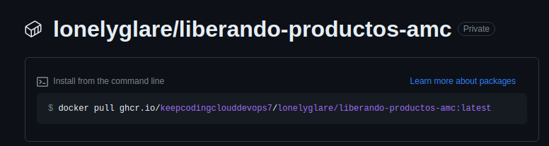
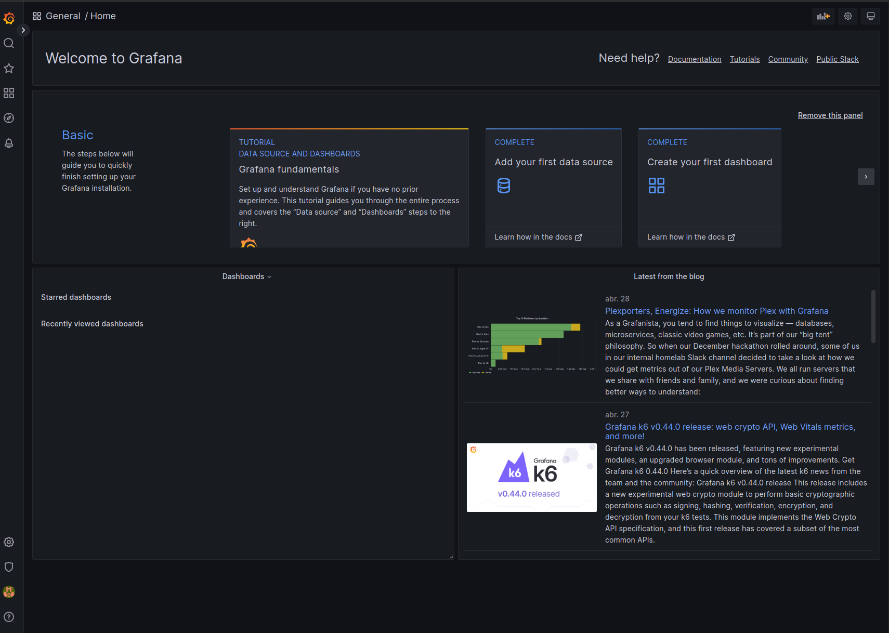
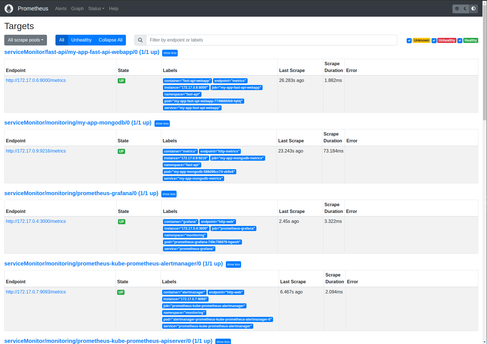
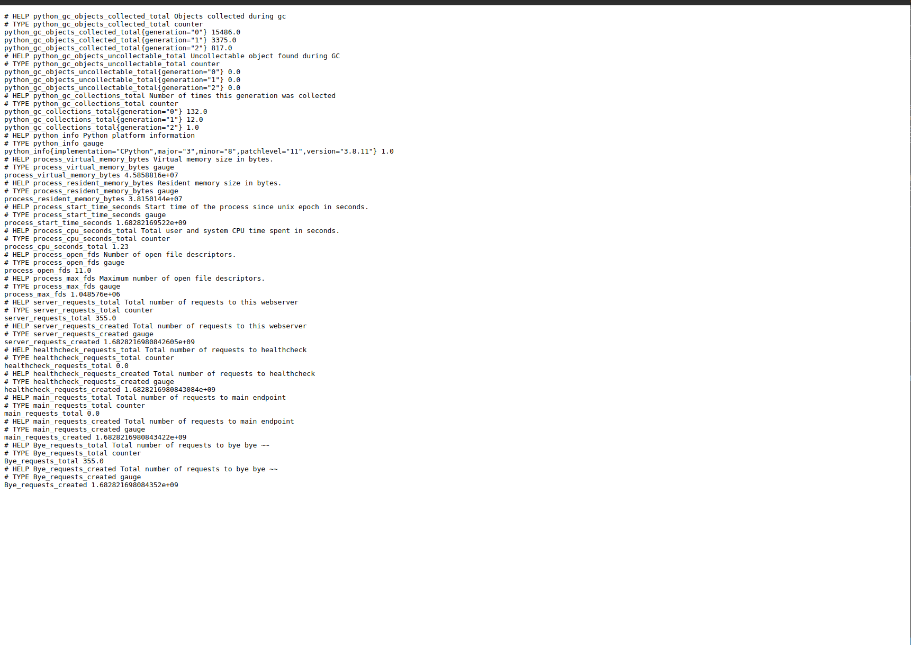

# Keepcoding-devops-liberando-productos-practica-final - Alejandro Moreno

## Pipeline

Hay un pipeline que publica las imagenes en dockerHub y GHCR y pasa unos test unitarios que dan cobertura a todo el codigo.




## Prometheus:
### Software Necesario:
 * Minikube - https://minikube.sigs.k8s.io/docs/
 * Kubectl - https://kubernetes.io/docs/reference/kubectl/kubectl
 * Helm - https://helm.sh

Por motivos de versionado de Prometheus se recomienda usar la version de Kubernetes 1.21 al lanzar minikube y para evitar posibles fallos se ha de usar tanto para la version de minikube y la propia la misma versión.
    https://github.com/prometheus-operator/kube-prometheus

    curl -LO https://dl.k8s.io/release/v1.21.0/bin/linux/amd64/kubectl
    sudo install -o root -g root -m 0755 kubectl /usr/local/bin/kubectl
    kubectl version --client


 * Para ver las métricas necesitamos Prometheus que a su vez necesita `minikube`:
   ```sh
   minikube start --kubernetes-version='v1.21.1' \
    --memory=4096 \
    --addons="metrics-server,default-storageclass,storage-provisioner" \
    -p monitoring-cluster
   ```

 * Añadir repositorio helm
   ```sh
   helm repo add prometheus-community https://prometheus-community.github.io/helm-charts
   ```

 * Desplegar chart Prometheus
   ```sh
   helm -n monitoring-cluster upgrade --install prometheus prometheus-community/kube-prometheus-stack -f kube-prometheus-stack/values.yaml --create-namespace --wait

 * Port-forward al service de prometheus - http://localhost:9090
   ```sh
   kubectl -n monitoring-cluster port-forward svc/prometheus-kube-prometheus-prometheus 9090:9090
   ```

 * Port-forward al service de grafana - http://localhost:3000
   ```sh
   kubectl -n monitoring-cluster port-forward svc/prometheus-grafana 3000:http-web
   ```

  * Accedemos a ambos puertos desde el navegador con:
    ```sh
    localhost:9090
    localhost:3000
    ```
  * Veremos en el 3000 el Grafana tal que accederemos a él con `admin` para el usuario y `prom-operator` para la contraseña
    y en el 9090 Prometheus
    
    

* Podemos observar los endpoints y sus contadores desde Prometheus haciendo:

  kubectl -n fast-api port-forward svc/my-app-fast-api-webapp 8000:8000

Desde el navegador con `localhost:8000` veremos todas los endpoints `/` ,` /health` , `/bye`:



 
 
 
 
 
 * Añadir repositorio helm bitnami:
   ```sh
   helm repo add bitnami https://charts.bitnami.com/bitnami
   helm repo update
   ```

 * Descargar dependencias en el directorio fast-api-webapp:
   
   ```sh
   helm dep up ./
   ```

 * Desplegar app con helm desde el directorio raiz:
   ```sh
   helm -n fast-api upgrade my-app --wait --install --create-namespace fast-api-webapp
   ```
* Lo exponemos:
     ```
    export POD_NAME=$(kubectl get pods --namespace fast-api -l "app.kubernetes.io/name=fast-api-webapp,app.kubernetes.io/instance=my-app" -o jsonpath="{.items[0].metadata.name}")

    export CONTAINER_PORT=$(kubectl get pod --namespace fast-api $POD_NAME -o jsonpath="{.spec.containers[0].ports[0].containerPort}")
    
    kubectl --namespace fast-api port-forward $POD_NAME 8080:$CONTAINER_PORT
     ```

## Funcionamiento de la alerta:


 * Obtenemos el POD
   ```sh
   export POD_NAME=$(kubectl get pods --namespace fast-api  -l "app.kubernetes.io/name=fast-api-webapp,app.kubernetes.io/instance=my-app" -o jsonpath="{.items[0].metadata.name}")
   ```

 * Nos conectamos al POD
   ```sh
   kubectl -n fast-api exec -it $POD_NAME -- /bin/sh
   ```
   * Dentro del POD
      
      
      * Instalamos software
         ```sh
         apk update && apk add git go
         ```
      
      
      
      * Descargamos software para prueba de estrés
         ```sh
         git clone https://github.com/jaeg/NodeWrecker.git
         cd NodeWrecker
         go build -o estres main.go
         ```
     
     
      * Ejecutamos binario
         ```sh
         ./estres -abuse-memory -escalate -max-duration 10000000
         ```

## Grafana

  * Dentro de Grafana en dahsboards/browse podras importar un dashboard personalizado llamado `Dashboard práctica AMC.json`


